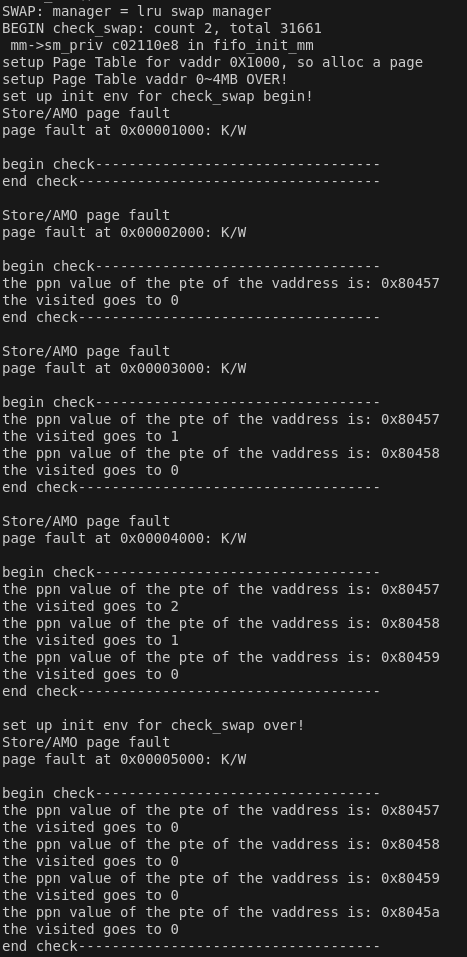
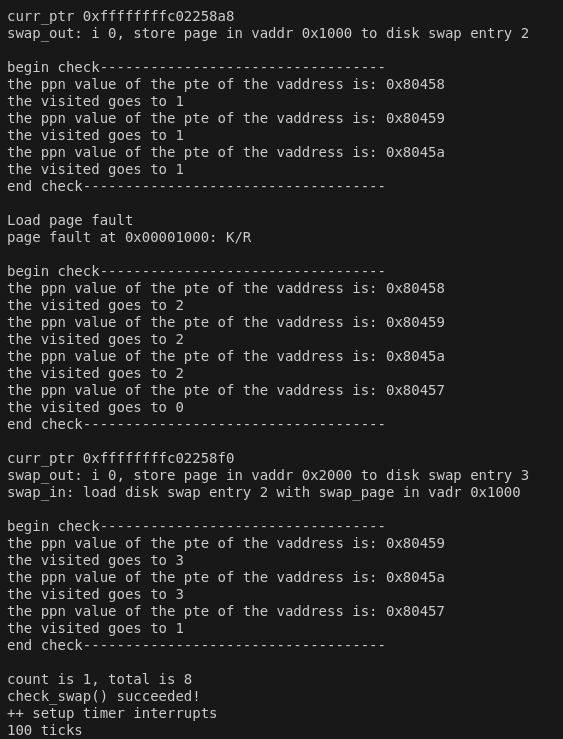

## <center> Lab3实验报告</center>


### 练习1：理解基于FIFO的页面替换算法（思考题）
描述FIFO页面置换算法下，一个页面从被换入到被换出的过程中，会经过代码里哪些函数/宏的处理（或者说，需要调用哪些函数/宏），并用简单的一两句话描述每个函数在过程中做了什么？（为了方便同学们完成练习，所以实际上我们的项目代码和实验指导的还是略有不同，例如我们将FIFO页面置换算法头文件的大部分代码放在了`kern/mm/swap_fifo.c`文件中，这点请同学们注意）
 - 至少正确指出10个不同的函数分别做了什么？如果少于10个将酌情给分。我们认为只要函数原型不同，就算两个不同的函数。要求指出对执行过程有实际影响,删去后会导致输出结果不同的函数（例如assert）而不是cprintf这样的函数。如果你选择的函数不能完整地体现”从换入到换出“的过程，比如10个函数都是页面换入的时候调用的，或者解释功能的时候只解释了这10个函数在页面换入时的功能，那么也会扣除一定的分数

**页面换入换出时，调用的函数/宏：**
* **swap_in()**：换入页面
  
   首先通过调用 alloc_page() 申请一个连续的内存区域，然后通过 get_pte() 获取目标虚拟地址的页表项，最后通过 swapfs_read() 从交换区读取数据到分配的物理页面，完成页面换入操作。
* **alloc_page()**：申请页面，调用pmm_manager->alloc_pages(n)来获取页面，如果有足够的物理页面，就不用换出了，但是如果物理页面不足，则要调用swap_out函数来换出页面
* **assert(result != NULL)**：确保分配页面成功，否则不能继续执行
* **get_pte()**:用于获得页表项
* **swapfs_read()**:读取页表项对应的硬盘中一个内存的物理页
* **swap_out()**:换出页面
  
  首先通过循环调用 sm->swap_out_victim() 选择要交换出的页面，然后使用 swapfs_write() 将页面数据写入交换区，更新页表项，并调用 free_page() 释放页面，最终通过 tlb_invalidate() 刷新TLB，确保页表变更生效，完成页面换出的操作
* **swap_out_victim()**:找到需要被换出的页面，对应于swap_fifo.c中的_fifo_swap_out_victim，即找到队列头部的页面（最早的页面）作为被换出的页面
* **assert((*ptep & PTE_V) != 0)**：确保获取的页表项有效才能继续执行
* swapfs_write():写入磁盘。因为需要换出页面，可能存在页面被访问过的情况，所以要将页面内容写入交换区(硬盘)，如果失败，则继续下一轮交换
* **map_swappable()**:将换入的页面添加到队列尾部。对应于swap_fifo.c的_fifo_map_swappable更新FIFO队列，将最新到达的页面链接到 pra_list_head 队列的尾部
* **free_page()**:释放页面，调用pmm_manager->free_pages释放页面,完成换出
* **tlb_invalidate()**:刷新TLB，调用flush_tlb刷新TLB


### 练习2：深入理解不同分页模式的工作原理（思考题）
get_pte()函数（位于`kern/mm/pmm.c`）用于在页表中查找或创建页表项，从而实现对指定线性地址对应的物理页的访问和映射操作。这在操作系统中的分页机制下，是实现虚拟内存与物理内存之间映射关系非常重要的内容。
 - get_pte()函数中有两段形式类似的代码， 结合sv32，sv39，sv48的异同，解释这两段代码为什么如此相像。
 - 目前get_pte()函数将页表项的查找和页表项的分配合并在一个函数里，你认为这种写法好吗？有没有必要把两个功能拆开？2.1 get_pte()代码的相似性思考

#### 2.1.1 sv32、sv39、sv48的异同

在RISC-V体系结构中，不同的分页模式（如 sv32, sv39, sv48）具有不同的虚拟地址空间和页表结构。它们的异同主要体现在以下几个方面：

##### 1. 虚拟地址空间大小：

- **Sv32**：支持32位虚拟地址空间，最多支持4GB的虚拟地址空间。地址的高20位用于页表索引，低12位用于页内偏移。
- **Sv39**：支持39位虚拟地址空间，最多支持512GB的虚拟地址空间。使用三级页表，虚拟地址中的27位用于虚拟页号（VPN），其余12位用于页内偏移。
- **Sv48**：支持48位虚拟地址空间，最多支持256TB的虚拟地址空间。使用四级页表，虚拟地址中的36位用于虚拟页号（VPN），其余12位用于页内偏移。

##### 2. 页表级别：

- **Sv32**：使用两级页表。虚拟地址的前20位分为两个10位段，用于索引页目录和页表。
- **Sv39**：使用三级页表。虚拟地址的前27位分为三个9位段，用于索引三级页表。
- **Sv48**：使用四级页表。虚拟地址的前36位分为四个9位段，用于索引四级页表。

##### 3. 地址转换与内存保护：

- **Sv32**：采用两级页表机制，通过两级转换将虚拟地址转换为物理地址，支持4KB页大小。
- **Sv39**：采用三级页表机制，支持4KB页面，同时支持2MB和1GB的大页（大页支持是在页表条目中的标志位控制的）。
- **Sv48**：与Sv39类似，但多了一级页表，能够映射更大的地址空间。

#### 2.1.2 get_pte()两段代码相似性的原因

`get_pte()` 的两段代码之所以相似，是因为它们都涉及通过多级页表查找或创建页表项的过程。尽管 sv32, sv39 和 sv48 的分页结构有所不同，但它们的本质操作是相同的：根据虚拟地址的不同部分，逐级查找页表项，如果某一级的页表项不存在或无效，则需要分配新的页表项。

```c
 pde_t *pdep1 = &pgdir[PDX1(la)];
    if (!(*pdep1 & PTE_V)) {
        struct Page *page;
        if (!create || (page = alloc_page()) == NULL) {
            return NULL;
        }
        set_page_ref(page, 1);
        uintptr_t pa = page2pa(page);
        memset(KADDR(pa), 0, PGSIZE);
        *pdep1 = pte_create(page2ppn(page), PTE_U | PTE_V);
    }
 pde_t *pdep0 = &((pde_t *)KADDR(PDE_ADDR(*pdep1)))[PDX0(la)];
```

这段代码通过检查页目录项（`pdep1`）是否有效，如果无效则分配一个新的物理页并初始化该页，将其映射到虚拟地址空间中。

```c
 pde_t *pdep0 = &((pde_t *)KADDR(PDE_ADDR(*pdep1)))[PDX0(la)];
```

接着，它计算并获取二级页表的地址（`pdep0`。通过一级页表项 `*pdep1` 获取对应的物理地址，然后将其转换为虚拟地址，接着利用虚拟地址 `la` 计算出二级页表的索引（`PDX0(la)`），最终可以获取二级页表中的具体页目录项（`pdep0`）。

```c
   if (!(*pdep0 & PTE_V)) {
    	struct Page *page;
    	if (!create || (page = alloc_page()) == NULL) {
    		return NULL;
    	}
    	set_page_ref(page, 1);
    	uintptr_t pa = page2pa(page);
    	memset(KADDR(pa), 0, PGSIZE);
 //   	memset(pa, 0, PGSIZE);
    	*pdep0 = pte_create(page2ppn(page), PTE_U | PTE_V);
    }
```

   这段代码检查二级页表项（`pdep0`）是否有效，如果无效，则同样分配一个新的物理页并初始化该页，最后返回三级页表项的地址

```c
 return &((pte_t *)KADDR(PDE_ADDR(*pdep0)))[PTX(la)];
```

这两段代码相似的原因主要在于页表管理的层次性。在一个多级页表（例如 32 位系统中的三级页表或 64 位系统中的四级页表）中，每一级页表都执行类似的任务：

1. **检查当前页表项是否有效**：首先检查页目录项或页表项是否已经有效。如果无效，就需要分配新的物理页面并初始化相应的页表项。
2. **分配新的页面**：如果页表项无效（即未分配物理页面），则会分配新的页面并更新页表项。
3. **更新页表**：通过 `pte_create()` 函数来创建并设置页表项，保证页表项指向有效的物理页。

每一层的页表都依赖于上一层的页表项，因此它们的操作是递归的、相似的。例如，检查页目录条目和页表条目的有效性，分配新的物理页，更新页表项等操作在每一层都执行相同的逻辑。

#### 2.2 get_pte()将页表项的查找与分配合并的合理性

在 `get_pte()` 函数中将查找和分配功能合并在一起是完全合理的，尤其是在处理缺页异常的场景中。这种设计将查找和分配的过程紧密结合，有以下几个好处：

##### 1. 简化代码逻辑

将查找和分配放在同一个函数中，可以避免在两次函数调用之间丧失上下文。尤其是当查找的页表项不存在时，分配新页表项是一个必要的操作，合并这两个步骤有助于减少复杂度。

##### 2. 避免错误的页面分配

如果将查找和分配拆开，外部代码在调用查找函数时，可能无法准确判断是在哪一层页表中出现了缺失，导致页表分配时出现冗余的操作，甚至可能出现错误的页面分配。通过合并查找与分配，`get_pte()` 可以依赖其递归逻辑在任何级别的缺失时进行合适的分配，从而更好地控制内存分配和错误处理。

##### 3. 性能优化

在缺页异常处理过程中，`get_pte()` 在执行过程中可以即时判断页表项是否有效，若无效，则直接进行分配。这可以减少额外的函数调用，提高程序的性能，尤其是在分页操作频繁的场景中。

##### 4. 简化异常处理

在缺页异常处理（如 `do_pgfault()`）中，`get_pte()` 既返回页表项，又能在缺失时进行页表项的分配，保证了异常处理的顺畅进行。如果分开实现，调用者在没有有效页表项时，还需要显式地进行内存分配，这不仅增加了代码复杂性，还容易出错。

##### do_pgfault中的使用示例

```c
pte_t *ptep = get_pte(mm->pgdir, addr, 1);
if (*ptep == 0) {  // 如果页表项为0，说明该页表项刚分配
    if (pgdir_alloc_page(mm->pgdir, addr, perm) == NULL) {
        cprintf("pgdir_alloc_page in do_pgfault failed\n");
        goto failed;
    }
}
```


### 练习3：给未被映射的地址映射上物理页（需要编程）
补充完成do_pgfault（mm/vmm.c）函数，给未被映射的地址映射上物理页。设置访问权限 的时候需要参考页面所在 VMA 的权限，同时需要注意映射物理页时需要操作内存控制 结构所指定的页表，而不是内核的页表。
请在实验报告中简要说明你的设计实现过程。请回答如下问题：
 - 请描述页目录项（Page Directory Entry）和页表项（Page Table Entry）中组成部分对ucore实现页替换算法的潜在用处。
 - 如果ucore的缺页服务例程在执行过程中访问内存，出现了页访问异常，请问硬件要做哪些事情？
- 数据结构Page的全局变量（其实是一个数组）的每一项与页表中的页目录项和页表项有无对应关系？如果有，其对应关系是啥？
  

**代码补充：**
```c
int do_pgfault(struct mm_struct *mm, uint_t error_code, uintptr_t addr) {
    
    int ret = -E_INVAL; 
    struct vma_struct *vma = find_vma(mm, addr);/
    pgfault_num++; 
    if (vma == NULL || vma->vm_start > addr) {
        cprintf("not valid addr %x, and  can not find it in vma\n", addr); 
        goto failed; 
    }

    uint32_t perm = PTE_U; 
    if (vma->vm_flags & VM_WRITE) { 
        perm |= (PTE_R | PTE_W); 
    }
    addr = ROUNDDOWN(addr, PGSIZE); 
    ret = -E_NO_MEM; 
    pte_t *ptep = NULL; 

    ptep = get_pte(mm->pgdir, addr, 1);  
    if (*ptep == 0) { 
        if (pgdir_alloc_page(mm->pgdir, addr, perm) == NULL) { 
            cprintf("pgdir_alloc_page in do_pgfault failed\n"); 息
            goto failed; 
        }
    } else {
        
        if (swap_init_ok) { 
            struct Page *page = NULL; 

            swap_in(mm, addr, &page);  
            page_insert(mm->pgdir, page, addr, perm); 
            swap_map_swappable(mm, addr, page, 1);  
            page->pra_vaddr = addr; 
        } else {
            cprintf("no swap_init_ok but ptep is %x, failed\n", *ptep); 
            goto failed; 
        }
   }
   ret = 0; 
failed:
    return ret; 
}

```
+ **swap_in(mm, addr, &page)**:根据页表基地址和虚拟地址完成磁盘的读取，写入内存，获取换入的内存中的物理页
+ **page_insert(mm->pgdir, page, addr, perm)**：将虚拟地址和物理页进行映射
+ **swap_map_swappable(mm, addr, page, 1)**：将新换入的页添加到队列的尾部

**潜在用处:**
+ 有效位：判断页面是否在内存中，替换算法需要检查PDE和PTE中的有效位，以确定哪些页已经调入内存，哪些页需要从外存加载。
+ 权限位：可读、可写、可执行，用于在页面替换算法中设置特定方法
+ 修改位：用于判断页面在被换出时是否需要写回磁盘，实现基于访问历史的替换算法

**页访问异常时，硬件应该：**
CPU将当前执行的指令地址以及导致异常的虚拟地址(通过CR2寄存器在x86架构上保存)存入特定寄存器或栈中，硬件会根据中断向量表(Interrupt Descriptor Table,IDT)中的页异常入口地址，触发 Page Fault 异常，进入do_pgdefault函数处理。

**数据结构Page的全局变量和页目录项和页表项有无对应关系：**
有对应关系。Page 数组中的每一项代表一个物理页,页表项中的页框号指向具体的物理页，并与 Page 结构的索引间接对应；Page 结构提供物理页管理功能，页表项负责虚拟地址到物理页的映射，两者相辅相成。

### 练习4：补充完成Clock页替换算法（需要编程）
通过之前的练习，相信大家对FIFO的页面替换算法有了更深入的了解，现在请在我们给出的框架上，填写代码，实现 Clock页替换算法（mm/swap_clock.c）。
请在实验报告中简要说明你的设计实现过程。请回答如下问题：

 - 比较Clock页替换算法和FIFO算法的不同。

#### swap_clock.c:

```c
static int
_clock_init_mm(struct mm_struct *mm)
{     
     /*LAB3 EXERCISE 4: YOUR CODE*/ 
     // 初始化pra_list_head为空链表
     list_init(&pra_list_head);
     // 初始化当前指针curr_ptr指向pra_list_head，表示当前页面替换位置为链表头
     curr_ptr = &pra_list_head;
     // 将mm的私有成员指针指向pra_list_head，用于后续的页面替换算法操作
     mm->sm_priv = &pra_list_head;
     //cprintf(" mm->sm_priv %x in fifo_init_mm\n",mm->sm_priv);
     return 0;
}
```

首先我们需要初始化一个链表，并设置链表的头部指针。`mm->sm_priv = &pra_list_head;` 这行代码将 `pra_list_head` 的地址赋值给了 `mm` 结构体中的 `sm_priv` 成员，这样 `sm_priv` 就指向了链表的头部，用于后续的链表操作。

```c
static int
_clock_map_swappable(struct mm_struct *mm, uintptr_t addr, struct Page *page, int swap_in)
{
    list_entry_t *entry=&(page->pra_page_link);

assert(entry != NULL && curr_ptr != NULL);
//record the page access situlation
/*LAB3 EXERCISE 4: YOUR CODE*/ 
// link the most recent arrival page at the back of the pra_list_head qeueue.
// 将页面page插入到页面链表pra_list_head的末尾
list_entry_t *head=(list_entry_t*) mm->sm_priv;
list_add(head->prev, entry);
// 将页面的visited标志置为1，表示该页面已被访问
page->visited  = 1;
return 0;

}
```

这个函数可以将一个页面添加到由 `mm->sm_priv` 指向的链表头部（反向插入，每次都插在链表头部，遍历时从链表尾向前遍历即可），并标记该页面为已访问。

```c
static int
_clock_swap_out_victim(struct mm_struct *mm, struct Page ** ptr_page, int in_tick)
{
     list_entry_t *head=(list_entry_t*) mm->sm_priv;
         assert(head != NULL);
     assert(in_tick==0);
     /* Select the victim */
     //(1)  unlink the  earliest arrival page in front of pra_list_head qeueue
     //(2)  set the addr of addr of this page to ptr_page
    struct Page *curr_page;
    while (1) {
        /*LAB3 EXERCISE 4: YOUR CODE*/ 
        // 编写代码
        // 遍历页面链表pra_list_head，查找最早未被访问的页面
        if (curr_ptr == head){  // 由于是将页面page插入到页面链表pra_list_head的末尾，所以pra_list_head制起标识头部的作用，跳过
            curr_ptr = list_next(curr_ptr);
        }
        // 获取当前页面对应的Page结构指针
        curr_page = le2page(curr_ptr, pra_page_link);
        // 如果当前页面未被访问，则将该页面从页面链表中删除，并将该页面指针赋值给ptr_page作为换出页面
        if (curr_page->visited != 1){
            *ptr_page = curr_page;
            cprintf("curr_ptr %p\n",curr_ptr);
            list_del(curr_ptr);
            break;
        }
        // 如果当前页面已被访问，则将visited标志置为0，表示该页面已被重新访问
        if (curr_page->visited == 1){
            curr_page->visited = 0;
        }
        curr_ptr = list_next(curr_ptr);
    }
    return 0;
}
```

实现始时钟算法的核心部分，循环遍历链表，寻找未被访问过的页面，如果找到的页面被访问过，则将访问位置为0，并从下一个页面继续寻找。

#### 比较Clock页替换算法和FIFO算法的不同：

1. **淘汰策略**：

   - **FIFO**：总是淘汰最先进入内存的页，即队列中最早的页。FIFO算法不需要记录页面的访问历史，只需要维护一个队列，队列头的页面就是最先进入的页面。
   - **时钟**：淘汰最老的页面，但这个“老”是指页面自上次被访问以来时间最长的页面。时钟算法通过环形链表和访问位来近似实现最近最少使用（LRU）算法。

2. **数据结构**：

   - **FIFO**：使用一个队列来维护页面的进入顺序。
   - **时钟**：使用一个环形链表来维护页面，并有一个指针（时钟指针）指向最老的页面。

3. **访问位的使用**：

   - **FIFO**：不需要访问位，因为它只基于页面进入内存的时间来决定替换哪个页面。
   - **时钟**：需要访问位来标记页面是否被访问过。当页面被访问时，访问位被设置为“1”，如果页面未被访问，则在页面替换时可能会被优先替换

   时钟页替换算法在本质上与 FIFO 算法是类似的，不同之处是在时钟页替换算法中跳过了访问位为 1 的页。

### 练习5：阅读代码和实现手册，理解页表映射方式相关知识（思考题）
如果我们采用”一个大页“ 的页表映射方式，相比分级页表，有什么好处、优势，有什么坏处、风险？

+ **好处**
  * **减少页表占用的内存空间**：分级页表需要为每一级页表分配内存（如页目录表、页表），而一个大页直接映射整个内存区域，只需一个页表项，大幅减少页表的存储需求。特别是在管理大内存时，一个大页可以覆盖更多的地址范围，显著降低页表存储开销。
  * **加速地址翻译**：一个大页消除了多级页表结构中的多次内存访问，使得地址翻译更快。对于频繁访问的大量连续内存区域，大页可以减少TLB（Translation Lookaside Buffer）缺失的概率，从而提升访问性能。
  * **提高TLB效率**：TLB中存储的是虚拟页到物理页的映射条目。大页对应一个更大的地址范围，因此相同数量的TLB条目可以映射更大的内存区域。
  * **简化页表管理**：大页的页表结构更简单，不需要维护多级页表的复杂层次结构。直接管理大页的分配与释放逻辑更直观。
+ **坏处**
  * **导致内存碎片化**：大页映射方式要求页的大小是固定的，当分配的内存量不足以填满一个大页时，未使用的部分会被浪费，导致内存碎片化严重。对于小内存分配请求，这种浪费尤为显著。
  * **灵活性较低**：一个大页无法支持更精细的内存管理需求。例如，当多个小程序需要映射到不同的内存区域时，大页可能显得过于粗放。不适用于大量小内存块的场景。
  * **权限和属性管理复杂**：如果需要为不同的虚拟页设置不同的权限或属性，一个大页可能无法满足需求，因为它覆盖了较大的地址范围。
  * **增加页替换开销**：在内存压力较大时，替换一个大页会涉及更大范围的数据，导致替换开销显著增加。
  * **可能导致缓存效率降低**：如果一个大页内的实际使用数据较为分散，缓存局部性可能变差，从而降低缓存性能。

### 扩展练习 Challenge：实现不考虑实现开销和效率的LRU页替换算法（需要编程）
challenge部分不是必做部分，不过在正确最后会酌情加分。需写出有详细的设计、分析和测试的实验报告。完成出色的可获得适当加分。

#### 设计思路

- 使用 visited 字段，记录页面最近的访问状态：

    - 通过_lru_check函数遍历链表，检查页面的访问位（PTE_A），页面被访问时，将 visited 清零。
    - 未被访问的页面每次检查时递增 visited 值。
    - visited 值最大的页面优先被换出。
- 页面访问和换出过程中，及时调用_lru_check对当前可交换页链表的各页访问情况进行更新。

#### 函数功能分析
- _lru_init_mm：初始化链表 pra_list_head，并关联至 mm 的私有数据字段 sm_priv。
- _lru_map_swappable：将新页面加入链表末尾，并标记其未被访问。
- _lru_check：遍历链表，检查页面的访问位（PTE_A）：

    - 访问位为1，表示最近访问过，清零并将页面的 visited 设置为0。
    - 否则，增加页面的 visited 值。

- _lru_swap_out_victim：

    - 遍历链表，找到 visited 值最大的页面作为换出目标。
    - 从链表中删除目标页面。

- _lru_check_swap：模拟页面访问和换出过程，验证算法的正确性。

#### 关键代码分析
##### ***_lru_check***函数
```c
static int _lru_check(struct mm_struct *mm)
{
    cprintf("\nbegin check----------------------------------\n");
    list_entry_t *head = (list_entry_t *)mm->sm_priv;   //头指针
    assert(head != NULL);
    list_entry_t *entry = head;
    while ((entry = list_prev(entry)) != head)
    {
        //通过宏 le2page(entry, pra_page_link) 获取 entry 对应的页面结构体指针。pra_page_link 是 Page 结构体中用于链表操作的指针。
        struct Page *entry_page = le2page(entry, pra_page_link);
        //获取页面的页表项：通过 get_pte 函数获取当前页面（entry_page）对应虚拟地址（entry_page->pra_vaddr）的页表项。pgdir 是当前进程的页表目录
        pte_t *tmp_pte = get_pte(mm->pgdir, entry_page->pra_vaddr, 0);
        cprintf("the ppn value of the pte of the vaddress is: 0x%x  \n", (*tmp_pte) >> 10);
        if (*tmp_pte & PTE_A)  //如果近期被访问过，visited清零(visited越大表示越长时间没被访问)
        {
            entry_page->visited = 0;
            *tmp_pte = *tmp_pte ^ PTE_A;//清除访问位
        }
        else
        {
            //未被访问就加一
            entry_page->visited++;
        }

        cprintf("the visited goes to %d\n", entry_page->visited);
    }
    cprintf("end check------------------------------------\n\n");
}

```
##### ***_lru_map_swappable***
相比于fifo，这里增加了对 check 函数的调用和对 page 的 visited 初始化为 0
```c
//页面是否可交换
static int _lru_map_swappable(struct mm_struct *mm, uintptr_t addr, struct Page *page, int swap_in)
{
    _lru_check(mm);//检查所有页面的访问情况并更新 visited 值,
    //具体来说，它遍历所有页面链表条目，检查每个页面的访问位（PTE_A），并根据访问情况调整页面的 visited 值。

    list_entry_t *entry = &(page->pra_page_link);//获取页面链表条目：获取页面 page 中的 pra_page_link，
    //这是页面的链表条目（list_entry_t）。它用于将页面链接到链表中

    //确保 entry 不为空。如果为空，则程序会在此处停止并报错。这确保页面的链表条目已正确初始化。
    assert(entry != NULL);
    //从 mm（进程的内存描述符）中的 sm_priv 成员获取链表头指针。
    //sm_priv 是存储与页面管理相关的私有数据，这里是存储页面链表头指针（pra_list_head）
    list_entry_t *head = (list_entry_t *)mm->sm_priv;

    list_add(head, entry); // 将页面page插入到页面链表pra_list_head的末尾
    page->visited = 0;     //标记为未访问
    //将页面的 visited 字段设置为 0，表示页面是新加入链表的，尚未被访问。visited 字段用于LRU算法判断页面的访问历史。
    return 0;
}
```
##### ***_lru_swap_out_victim***函数
```c
static int _lru_swap_out_victim(struct mm_struct *mm, struct Page **ptr_page, int in_tick)
{//从页面链表中选择一个页面进行换出，即选择一个需要被替换的页面
    _lru_check(mm);//检查并更新页面的访问情况。它会遍历链表中的每个页面，检查它们的访问状态，
    //并更新 visited 值。如果页面被访问过，则将 visited 设置为 0；如果没有被访问过，则递增 visited 值。

    list_entry_t *head = (list_entry_t *)mm->sm_priv;//从 mm（进程的内存描述符）中的 sm_priv 成员获取链表头指针。
    assert(head != NULL);
    assert(in_tick == 0);//此断言确保当前函数没有在定时器触发的时间点被调用。
    
    list_entry_t *entry = list_prev(head);//初始化 entry 为链表头的前一个元素（即链表的最后一个元素）
    list_entry_t *pTobeDel = entry;//并将 pTobeDel 设置为 entry。同时，获取 entry 所指向页面的 visited 值，并将其存储在 largest_visted 变量中
    uint_t largest_visted = le2page(entry, pra_page_link)->visited;     //最长时间未被访问的page，比较的是visited
    while (1)
    {
        //entry转一圈，遍历结束
        // 遍历找到最大的visited，表示最早被访问的
        if (entry == head)
        {
            break;
        }
        if (le2page(entry, pra_page_link)->visited > largest_visted)
        //如果该页面的 visited 值大于 largest_visted，表示它是访问时间最久的页面，
    //更新 largest_visted 和 pTobeDel 指向该页面。
        {
            largest_visted = le2page(entry, pra_page_link)->visited;
            // le2page(entry, pra_page_link)->visited = 0;
            pTobeDel = entry;
            // curr_ptr = entry;
        }
        //将 entry 更新为链表中的前一个元素（即继续向链表的前面遍历）。
        entry = list_prev(entry);
    }
    //通过 list_del(pTobeDel) 将 pTobeDel 从链表中删除，表示该页面将被换出
    list_del(pTobeDel);
    //将 pTobeDel 转换为对应的 Page 结构体指针，并通过 ptr_page 返回给调用者，表示被选中的换出页面
    *ptr_page = le2page(pTobeDel, pra_page_link);
    cprintf("curr_ptr %p\n", pTobeDel);
    return 0;
}
```
#### 测试设计
##### 测试目标
- 验证 LRU 页替换算法的正确性：

    - 确保页面被访问时，pgfault_num（页故障计数器）在适当的条件下增加。
    - 访问未被置换的页面时，pgfault_num 不应变化。
    - 重复访问或修改一个页面时，算法的行为应符合预期。
##### 测试流程
(1) 初始化与第一次访问
```c
*(unsigned char *)0x3000 = 0x0c;//首次访问 0x3000 地址，触发页面置换
assert(pgfault_num == 4); //验证：页故障计数器 pgfault_num 应增加到 4
```

(2) 访问多个页面
```c
//访问多个地址 0x1000、0x4000、0x2000，此时这些页面已在内存中，因此不会触发页故障
    验证：pgfault_num 保持不变。
*(unsigned char *)0x1000 = 0x0a;
assert(pgfault_num == 4);  

*(unsigned char *)0x4000 = 0x0d;
assert(pgfault_num == 4);  

*(unsigned char *)0x2000 = 0x0b;
assert(pgfault_num == 4);  
```
    
(3) 超出内存容量触发页面置换
```c
//访问新地址 0x5000，超出内存页面容量，触发页替换,页故障计数器 pgfault_num 增加到 5
*(unsigned char *)0x5000 = 0x0e;
assert(pgfault_num == 5);  
```

(4) 重复访问已存在的页面
```c
//多次访问 0x2000 和 0x1000，这些页面仍在内存中。pgfault_num 不应变化，因为无需加载新页面。
*(unsigned char *)0x2000 = 0x0b;
assert(pgfault_num == 5);  
*(unsigned char *)0x1000 = 0x0a;
assert(pgfault_num == 5);  
```

(5) 检查页面值正确性
```c
//确保页面数据正确
assert(*(unsigned char *)0x1000 == 0x0a);
```

(6) 模拟页面被置换后的访问
```c
//修改触发页故障，pgfault_num 应增加到 6。确保修改后的页面被正确加载并更新
*(unsigned char *)0x1000 = 0x0a;  
assert(pgfault_num == 6);  
```

##### 测试用例覆盖范围

| **场景**                  | **测试点**                                  | **是否覆盖** |
|---------------------------|---------------------------------------------|--------------|
| 首次访问页面，触发页面加载 | 页故障计数器增加                             | 是           |
| 访问已在内存中的页面       | 页故障计数器不变化                            | 是           |
| 超出内存容量后触发页面置换 | 页故障计数器增加 + 替换最久未访问的页面         | 是           |
| 修改页面数据，模拟页面被置换后的访问 | 页故障计数器增加 + 数据正确性                | 是           |

#### 输出结果
使用make qemu命令，输出结果如下


