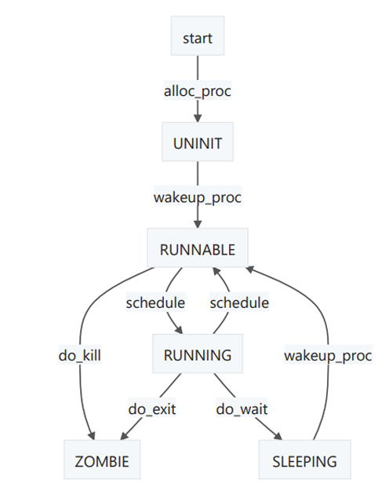

# lab5实验报告
## 练习0 填写已有实验
本实验依赖实验2/3/4。请把你做的实验2/3/4的代码填入本实验中代码中有“LAB2”/“LAB3”/“LAB4”的注释相应部分。注意：为了能够正确执行lab5的测试应用程序，可能需对已完成的实验2/3/4的代码进行进一步改进。

### 填写内容：
在相应文件完善有“LAB2”/“LAB3”/“LAB4”的注释的代码，并且对alloc_proc添加额外的初始化：
```c
proc->wait_state = 0;  // 进程等待状态初始化为0
proc->cptr = proc->yptr = proc->optr = NULL;  // 进程间指针初始化为NULL
```

## 练习1 加载应用程序并执行（需要编码）
do_execv函数调用load_icode（位于kern/process/proc.c中）来加载并解析一个处于内存中的ELF执行文件格式的应用程序。你需要补充load_icode的第6步，建立相应的用户内存空间来放置应用程序的代码段、数据段等，且要设置好proc_struct结构中的成员变量trapframe中的内容，确保在执行此进程后，能够从应用程序设定的起始执行地址开始执行。需设置正确的trapframe内容。

请在实验报告中简要说明你的设计实现过程。

- 请简要描述这个用户态进程被ucore选择占用CPU执行（RUNNING态）到具体执行应用程序第一条指令的整个经过。

### 实现过程
load_icode函数的作用是加载并解析一个处于内存中的 ELF 执行文件格式的应用程序。
第 6 步具体来说，需要设置正确的 trapframe 内容，包括 tf->gpr.sp、tf->epc 和 tf->status：
- tf->gpr.sp 是用户栈顶（即 sp 的值）
- tf->epc 是用户程序的入口地址（即 sepc 的值）
- tf->status 是适合用户程序的状态（即 sstatus 的值）。需要注意的是，正确设置trapframe，用户级进程就可以从内核返回到用户模式。因此，这里设置 SPP 为 0，以便返回到用户模式，同时设置 SPIE 为 1，以便处理中断.
```c
tf->gpr.sp = USTACKTOP;  // 用户栈顶
tf->epc = elf->e_entry;  // 用户程序入口
tf->status = (read_csr(sstatus) & ~SSTATUS_SPP & ~SSTATUS_SPIE);  // 用户态
```
### 问题回答
当用户态进程被 ucore 内核选择占用 CPU 执行（进入 RUNNING 态）时，整个过程的经过如下：


1. 进程创建与唤醒：

- 在 init_main 中，内核通过 kernel_thread 调用 do_fork 创建并唤醒一个新的线程，并让该线程执行 user_main。此时，该线程的状态变为 PROC_RUNNABLE，表示该线程已经开始运行。

2. 执行用户进程：

- 在 user_main 函数中，调用了宏 KERNEL_EXECVE，从而触发了 kernel_execve 函数的执行。
3. 触发断点异常：

- 在 kernel_execve 中，执行 ebreak 指令，触发断点异常。此时，CPU 会转到异常处理程序，即 __alltraps，然后进入 trap 函数，再通过 trap_dispatch 调度到相应的中断处理函数，最终进入 exception_handler，并跳转到 CAUSE_BREAKPOINT 处理断点异常。
4. 进入系统调用处理：

- 在 CAUSE_BREAKPOINT 处，调用了 syscall 函数。根据传递的参数，确定执行 sys_exec，并调用 do_execve 以开始执行加载程序的操作。
5. 加载应用程序：

- 在 do_execve 中，调用 load_icode 来加载用户应用程序的执行文件。此过程包括解析 ELF 格式的可执行文件，申请内存空间，建立用户态虚拟内存空间，加载程序的各个段（如代码段、数据段等）。
  - 具体地，内核通过 mm_create 为进程申请内存管理结构，并初始化 mm（进程的内存管理数据结构）。
  - 使用 setup_pgdir 为进程申请页目录表，并拷贝内核虚空间的映射，确保用户空间与内核空间的正确映射。
  - ELF 文件解析后，通过 mm_map 函数将程序的各个段映射到用户态虚拟地址空间中，同时分配物理内存并建立相应的虚拟地址与物理地址的映射。
  - 栈空间也被映射，并为用户栈分配足够的内存。
  - 重新设置进程的中断帧，确保在执行 iret 指令时，能够正确地从内核态跳转回用户态，并恢复到用户进程的虚拟地址空间中。
  
6. 返回用户态并执行应用程序：

- 加载完毕后一路返回，直到__alltraps的末尾，接着执行__trapret后的内容，到sret，表示退出S态，回到用户态执行，这时开始执行用户的应用程序

## 练习2: 父进程复制自己的内存空间给子进程（需要编码） 

*创建子进程的函数`do_fork`在执行中将拷贝当前进程（即父进程）的用户内存地址空间中的合法内容到新进程中（子进程），完成内存资源的复制。具体是通过`copy_range`函数（位于kern/mm/pmm.c中）实现的，请补充`copy_range`的实现，确保能够正确执行。*

*请在实验报告中简要说明你的设计实现过程。*

- *如何设计实现`Copy on Write`机制？给出概要设计，鼓励给出详细设计。*

> *Copy-on-write（简称COW）的基本概念是指如果有多个使用者对一个资源A（比如内存块）进行读操作，则每个使用者只需获得一个指向同一个资源A的指针，就可以该资源了。若某使用者需要对这个资源A进行写操作，系统会对该资源进行拷贝操作，从而使得该“写操作”使用者获得一个该资源A的“私有”拷贝—资源B，可对资源B进行写操作。该“写操作”使用者对资源B的改变对于其他的使用者而言是不可见的，因为其他使用者看到的还是资源A。*

### 2.1 问题1

#### 回答：

**copy_range函数的调用过程：do_fork()---->copy_mm()---->dup_mmap()---->copy_range()。**

其中：

* do_fork函数调用的copy_mm函数在LAB4中没有实现，其他的过程和lab4一样，都是创建一个进程，并放入CPU中调度。**本次我们要重点实现如何完成从父进程把内存复制到子进程中。**
* copy_mm：使用互斥锁（用于避免多个进程同时访问内存）。进下一层的调用dup_mmap函数。
* dup_mmap接受两个参数，前一个mm是待复制的内存，而复制的源内容在oldmm（父进程）内容中。只是完成了新进程中的段创建。**具体行为最终落到copy_range中。**

最后到了copy_range中，**用于在内存页级别上复制一段地址范围的内容。**首先，它通过`get_pte`函数获取源页表中的页表项，并检查其有效性。然后它在目标页表中获取或创建新的页表项，并为新的页分配内存。最后，它确保源页和新页都成功分配**，并准备进行复制操作，也就是我们需要完成的。主要分为四步：**

* 首先通过刚开始获取的page即源page通过宏page2kva**转换为源虚拟内存地址**。
* 同样的将要复制过去的n个page**转换为目的虚拟内存地址**。
* 通过**memcpy**将虚拟地址进行复制，复制其内容。
* 最后我们再使用前面的参数（to是目标进程的页目录地址，npage是页，start是起始地址，perm是提取出的页目录项ptep中的PTE_USER即用户级别权限相关的位）**调用page_insert函数。**

```c++
void *src_kvaddr = page2kva(page); // Get the kernel virtual address of the source page.
            void *dst_kvaddr = page2kva(npage); // Get the kernel virtual address of the destination page.

            memcpy(dst_kvaddr, src_kvaddr, PGSIZE); // Copy the content of the source page to the destination page.

            ret = page_insert(to, npage, start, perm); // Insert the destination page into the page table of the target process.
```

### 2.2 问题2

*如何设计实现`Copy on Write`机制？给出概要设计，鼓励给出详细设计。*

#### 回答：

Copy-on-write机制顾名思义——写时复制，也就是说其设计的核心思想有以下两点：

- 多个进程执行读操作时，共享同一份资源
- 某一个进程执行写操作时，复制生成私有资源副本

基于此我们给出具体的设计思路：

1. **设置内存资源共享标记**

在`dup_mm`函数中设置共享标记share，当share为1时表示启用COW机制。

1. **页面拷贝策略**
   1. **只读权限：** 由于共享页面同时被父子进程访问，为防止任一进程的写操作影响到另一个进程，将这些共享页面的权限设置为只读。
   2. **共享页映射：** 修改`pmm.c`中的`copy_range` 函数的实现，当share为1的时候，采用共享的方式——只复制页表，而不是整个内存。
2. **页面错误处理**

在我们COW的机制下，由于页面权限设置为只读，因此当某个进程尝试写操作时，会触发缺页异常（Page Fault）。为了实现写时复制，我们需要在缺页异常处理`do_fault`函数中实现整个内存的复制，同时设置可写权限。

值得注意的是，当仅有一个页面使用共享资源时，标记为可写权限。


## 练习3 阅读分析源代码，理解进程执行 fork/exec/wait/exit 的实现，以及系统调用的实现（不需要编码）
请在实验报告中简要说明你对 fork/exec/wait/exit函数的分析。并回答如下问题：

- 请分析fork/exec/wait/exit的执行流程。重点关注哪些操作是在用户态完成，哪些是在内核态完成？内核态与用户态程序是如何交错执行的？内核态执行结果是如何返回给用户程序的？
- 请给出ucore中一个用户态进程的执行状态生命周期图（包执行状态，执行状态之间的变换关系，以及产生变换的事件或函数调用）。（字符方式画即可）

### 问题1
函数分析：
#### ``fork()``
在用户态调用，调用
sys_fork() 的syscall时进入内核态，调用了
do_fork() 函数来创建新的进程。

do_fork() 函数是一个内核级函数，它负责分配新的进程资源，并将其放入内存中。然后，它
会设置当前进程的上下文，使其能够执行新的程序，为子进程创建用户栈、内核栈等。并将控制权交给
新的进程。

如果创建或执行过程中出现错误，那么它会立即返回-1表示失败。 当
do_fork() 函数完成其
任务后，它会返回到
sys_fork() 函数，并返回创建的进程的PID用户程序。
#### ``exec()``
在用户态调用，它会替换当前进程的映像（包括代码和数据）为一个新的程序的映像，然后开始执行新程序。exec 在内核态完成实际的映像替换工作，然后将控制权返回给用户态，开始执行新程序。
#### ``wait()``
在用户态开始执行，它会使父进程暂停，直到一个子进程结束。如果子进程已经结束，wait 会立即返回。wait 在内核态检查子进程的状态，如果所有子进程都还在运行，wait 会使父进程进入睡眠状态，直到有一个子进程结束。当子进程结束时，内核会唤醒父进程，wait 返回结束的子进程的 PID。
#### ``exit()``
在用户态调用，用于结束当前进程，释放掉一部分内存（还有一部分可能由父进程进行释
放），并将该进程标记为ZMOBIE状态。如果它的父进程处于等待子进程退出的状态，则唤醒父进程，
将子进程交给initproc处理，并进行进程调度。


#### ``内核态与用户态程序是如何交错执行的？`` 
当用户态进程调用一个系统调用时，它会将控制权交给内核，并传递系统调用的类型值给内核。然后，
内核会在内核态下执行相应的操作，并将结果返回给进程。在这个过程中，进程是无法执行任何其他操
作的。
#### ``内核态执行结果是如何返回给用户程序的？`` 
内核将系统调用的结果（通常是状态码或错误代码）保存在一个寄存器中，并切换到用户态。当进程重
新获得控制权时，它可以读取寄存器中的结果，并根据需要进行处理。
### 问题2
执行流程

- 系统调用部分在内核态进行，用户程序的执行在用户态进行
- 内核态通过系统调用结束后的sret指令切换到用户态，用户态通过发起系统调用产生ebreak异常切换到内核态
- 内核态执行的结果通过kernel_execve_ret将中断帧添加到线程的内核栈中，从而将结果返回给用户

用户态进程的执行状态生命周期图:

## 扩展练习
### 1.COW机制实现 
COW的主要实现部分在cow.c文件内

COW机制主要在于创建新进程时，只将父进程的栈和虚拟内存的页表，并不分配新的页，权限仅为读操作，不能进行写操作；而当一个程序进行写操作时，会重新分配一款空间，将访问的页面复制进去

因此，在do_fork函数中，将copy_mm函数改为COW机制下的cow_copy_mm函数
```c++
// if(copy_mm(clone_flags, proc) != 0) {
//     goto bad_fork_cleanup_kstack;
// }
if(cow_copy_mm(proc) != 0) {
    goto bad_fork_cleanup_kstack;
}
```
在do_pgfault函数中，如果页表执行写操作，则跳转到COW机制下的cow_pgfault函数执行`
```c++
// 判断页表项权限，如果有效但是不可写，跳转到COW
if ((ptep = get_pte(mm->pgdir, addr, 0)) != NULL) {
    if((*ptep & PTE_V) & ~(*ptep & PTE_W)) {
        return cow_pgfault(mm, error_code, addr);
    }
}
```

**具体函数实现**
* cow_copy_mm复制虚拟内存空间——与原copy_mm函数类似
  ```c++
    int cow_copy_mm(struct proc_struct *proc) {
    struct mm_struct *mm, *oldmm = current->mm;
  
    /* current is a kernel thread */
    if (oldmm == NULL) {
        return 0;
    }
    int ret = 0;
    if ((mm = mm_create()) == NULL) {
        goto bad_mm;
    }
    if (setup_pgdir(mm) != 0) {
        goto bad_pgdir_cleanup_mm;
    }
    lock_mm(oldmm);
    {
        ret = cow_copy_mmap(mm, oldmm);
    }
    unlock_mm(oldmm);
  
    if (ret != 0) {
        goto bad_dup_cleanup_mmap;
    }
  
    good_mm:
        mm_count_inc(mm);
        proc->mm = mm;
        proc->cr3 = PADDR(mm->pgdir);
        return 0;
    bad_dup_cleanup_mmap:
        exit_mmap(mm);
        put_pgdir(mm);
    bad_pgdir_cleanup_mm:
        mm_destroy(mm);
    bad_mm:
        return ret;
    }
  ```
* cow_copy_mmap拷贝内存映射——类似dup_mmap，但是share=1设置为共享,也就是不独立
  
  ```c++
    int cow_copy_mmap(struct mm_struct *to, struct mm_struct *from) 
    {
    assert(to != NULL && from != NULL);
    list_entry_t *list = &(from->mmap_list), *le = list;
    while ((le = list_prev(le)) != list) {
        struct vma_struct *vma, *nvma;
        vma = le2vma(le, list_link);
        nvma = vma_create(vma->vm_start, vma->vm_end, vma->vm_flags);
        if (nvma == NULL) {
            return -E_NO_MEM;
        }
        insert_vma_struct(to, nvma);
        if (cow_copy_range(to->pgdir, from->pgdir, vma->vm_start, vma->vm_end) != 0) {
            return -E_NO_MEM;
        }
    }
    return 0;
    }
  ```
* cow_copy_range具体设置页表项指向——类似copy_range,但是不执行真正的页面复制，只将页表项指向原来的页
  
  ```c++
    int cow_copy_range(pde_t *to, pde_t *from, uintptr_t start, uintptr_t end) {
    assert(start % PGSIZE == 0 && end % PGSIZE == 0);
    assert(USER_ACCESS(start, end));
    do {
        pte_t *ptep = get_pte(from, start, 0);
        if (ptep == NULL) {
            start = ROUNDDOWN(start + PTSIZE, PTSIZE);
            continue;
        }
        if (*ptep & PTE_V) {
            *ptep &= ~PTE_W;
            uint32_t perm = (*ptep & PTE_USER & ~PTE_W);
            struct Page *page = pte2page(*ptep);
            assert(page != NULL);
            int ret = 0;
            ret = page_insert(to, page, start, perm);
            assert(ret == 0);
        }
        start += PGSIZE;
    } while (start != 0 && start < end);
    return 0;
    }
  ```
* cow_pgfault基于COW的缺页异常——真正设置物理页面的复制
  ```c++
    int cow_pgfault(struct mm_struct *mm, uint_t error_code, uintptr_t addr)
    {
    int ret = 0;
    pte_t *ptep = NULL;
    ptep = get_pte(mm->pgdir, addr, 0);
    uint32_t perm = (*ptep & PTE_USER) | PTE_W;
    struct Page *page = pte2page(*ptep);
    struct Page *npage = alloc_page();
    assert(page != NULL);
    assert(npage != NULL);
    uintptr_t* src = page2kva(page);
    uintptr_t* dst = page2kva(npage);
    memcpy(dst, src, PGSIZE);
    uintptr_t start = ROUNDDOWN(addr, PGSIZE);
    *ptep = 0;
    ret = page_insert(mm->pgdir, npage, start, perm);
    ptep = get_pte(mm->pgdir, addr, 0);
    return ret;
    }
  ```

### 2.用户程序加载

在本次实验中，用户程序是在 **操作系统启动时** 被 **预先加载到内存中**，具体通过将程序的二进制代码在内核编译时直接链接进内核镜像，实现了在内核启动时就将用户程序加载到内存中。与常用操作系统的加载方式有以下几个区别：

1. **实验中的加载方式**：由于实验中的操作系统没有实现文件系统，用户程序无法从磁盘等外部存储设备加载。为简化实现，用户程序的二进制代码直接嵌入到内核镜像中，在操作系统启动时就将其加载到内存中。这样做可以避免开发文件系统和处理磁盘I/O的复杂性。
2. **常用操作系统的加载方式**：在常用操作系统中，用户程序通常存储在磁盘或其他外部设备上，操作系统只有在需要执行该程序时，才会动态地将程序从外部存储加载到内存中。加载过程包括程序头部解析、内存分配、地址重定位等步骤。
3. **区别与原因**：实验中的方式适用于没有文件系统的环境，简化了操作系统的实现，而常用操作系统则依赖外部存储和文件系统在运行时加载程序。由于本实验的文件系统未实现，所以选择将用户程序直接编译到内核镜像中，使得实验能够在没有外部存储的情况下执行。
